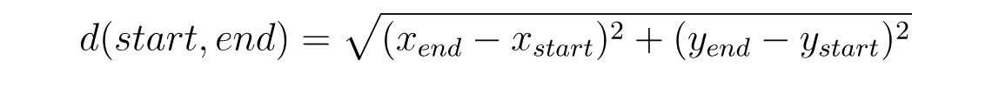

# Assignment Object Oriented Programming with Java

This is an assignment for the course Object Oriented Programming with Java for students of VIVES University in Bruges.

The goal of this assignment is to learn the basics of OOP.

## Assignment

This directory contains a maven project that is accompanied by unit tests that need to succeed in order for the project to work correctly. Fix all the failing tests by adding the necessary implementation to the different classes.

Also make sure to **fill in the report** (which can be found in the file `report.md`).

## Line Segment

In geometry, a line segment is a part of a line that is bounded by two distinct end points. From now on we refer to these points as the start point and end point of the line segment. Each point in turn has an `x` and a `y` coordinate. Both are of type int.

Create both a class `Point` and a class `LineSegment`.

### Point

The point class should adhere to the following UML diagram:

```text
----------------------
Point
----------------------
- x: int
- y: int
----------------------
+ Point()
+ Point(x: int, y: int)
+ getX(): int
+ getY(): int
+ setX(x: int)
+ setY(y: int)
+ toString(): String
----------------------
```

Implement all of these attributes and methods. If done correctly the unit tests found in `PointTest.java` should succeed.

The `toString()` method is a method that returns a String representation of the object. Here in case of Point it should return the coordinates in the format `[x, y]` where `x` and `y` are the actual attribute values.

The `toString()` method can be defined using the template below:

```java
@Override
public String toString() {
  return "somestring";
}
```

### LineSegment

A `LineSegment` object consists of two points, a start and an end. This can be achieved by adding two attributes inside the class of type `Point`.

Start by create a constructor that takes in the four coordinates as shown in the following UML diagram:

```text
----------------------
LineSegment
----------------------
- start: Point
- end: Point
----------------------
+ LineSegment(xStart: int, yStart: int, xEnd: int, yEnd: int)
+ length(): double
+ slope(): double
+ toString(): String
----------------------
```

You should also provide a method to calculate the length of the segment. This can be achieved by using the following formula:



<!-- Calculated @`http://latex.codecogs.com/svg.latex?d(start,end) = \sqrt{(x_{end}-x_{start})^{2} + (y_{end}-y_{start})^{2}}` -->

Also provide a method that determines the slope of the segment (RICO). This can be achieved using the formula:


<!-- Calculated @`http://latex.codecogs.com/svg.latex?m = \tan (\theta) = \frac{y_{end}-y_{start}}{x_{end}-x_{start}}` -->

Last add a `toString()` method that returns a String with the following format of a LineSegment:

```text
Line starts @ [234, 22] and ends at [2, -13].
Its length is 234.63 and it has a slope of 0.32.
```

You can format length and slope to have a fixed number of digits using the following code snippet: `String fixed = String.format("%1$,.2f", 88.1234567);` Use this only inside of the `toString()` method.

So `System.out.println(String.format("%1$,.2f", 88.1234567));` would result in `88.12`.

As can be seen from the UML diagram, you do not need to provide setters and getters for the points.

## Solution

The solution to this assignment can be found in the solution branch. Clone the repo and checkout the branch.

```shell
git clone https://github.com/oop-solutions-and-demos/oop1_assignment_linesegment-app-with-solution.git
cd oop1_assignment_linesegment-app-with-solution
git checkout solution
```